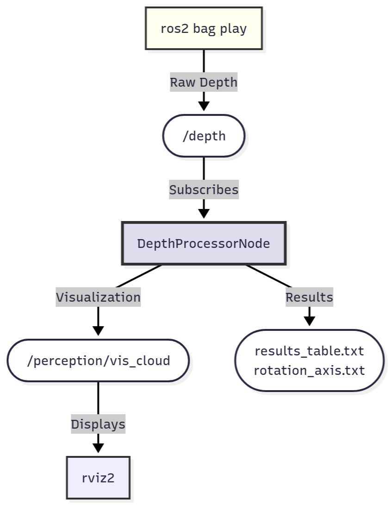

# 3D Cuboid Rotation Estimation from Depth Data

## 1. Overview
This project is a complete ROS 2 implementation of a 3D perception pipeline. The system processes depth images from a ROS 2 bag file (`.db3`) to find a rotating 3D cuboid. It converts each depth frame into a 3D point cloud, performs plane fitting to find the largest visible face, and estimates its rotation angle, visible area, and axis of rotation. The entire system is launched from a single launch file, including the bag playback, the processing node, and a pre-configured RVIZ visualization.

---

## 2. Demonstration Video 🎥

[**Demonstration video.**](https://drive.google.com/file/d/10PMTo_A2A3om7rLbrXHAcSpz88P2nquy/view?usp=drive_link)
---

## 3. Features
* **ROS 2 Bag Processing:** Reads `sensor_msgs/msg/Image` data directly from a `.db3` bag file.
* **3D Reconstruction:** Converts 2D depth images into 3D point clouds using the pinhole camera model.
* **RANSAC Plane Fitting:** Uses `open3d`'s RANSAC implementation to robustly find the largest planar face (the cuboid's face) in the point cloud.
* **Geometric Property Estimation:**
    * Calculates the **normal angle** of the face relative to the camera.
    * Calculates the **visible area** ($m^2$) of the face using its oriented bounding box.
    * Estimates the **axis of rotation** by averaging the cuboid's centroid.
* **Rich RVIZ Visualization:** A pre-configured RViz setup to visualize:
    * The processed 3D point cloud.
    * The detected largest face colored **red** (inliers).
    * The rest of the point cloud colored **gray** (outliers).
* **Automatic Data Logging:** On shutdown (Ctrl+C), the node automatically saves the final `results_table.txt` and `rotation_axis.txt` to the specified directory.

---

## 4. System Architecture
This project is built around a single, powerful ROS 2 node, `DepthProcessorNode`. This node acts as the central hub for all perception logic, subscribing to raw data, processing it, and publishing results. This centralized design is ideal for a single, focused perception task.



### ROS 2 Interface
* **Subscribed Topics:**
    * `/depth` (`sensor_msgs/msg/Image`): Provides the raw depth images from the ROS bag.
* **Published Topics:**
    * `/perception/vis_cloud` (`sensor_msgs/msg/PointCloud2`): Publishes the colored 3D point cloud for RVIZ.
    * `/perception/normal_angle` (`std_msgs/msg/Float64`): Publishes the estimated angle of the largest face.
    * `/perception/visible_area` (`std_msgs/msg/Float64`): Publishes the estimated area of the largest face.
    * `/perception/rotation_axis_point` (`geometry_msgs/msg/Point`): Publishes the average centroid of the cuboid.
* **Parameters:** All key settings are exposed as ROS 2 parameters and are configured in `config/params.yaml`.

---

## 5. Core Algorithms

### 5.1. 3D Reconstruction (Un-projection)
The 2D depth image (a grid of pixels) is "un-projected" into a 3D point cloud. This is achieved by applying the inverse pinhole camera model to each pixel $(u, v)$ using its known depth value $Z$:
$$
X = (u - c_x) \cdot \frac{Z}{f_x}
$$
$$
Y = (v - c_y) \cdot \frac{Z}{f_y}
$$

**Critical Assumption:** Since the camera's intrinsic matrix ($K$) was not provided, this project **assumes a standard intrinsic matrix** (fx, fy, cx, cy) based on a typical 640x480 camera. These values are set as parameters in `config/params.yaml`.

### 5.2. Plane Fitting: RANSAC
The **Random Sample Consensus (RANSAC)** algorithm is used to find the dominant plane in the 3D point cloud. This method is highly robust to noise and outliers (e.g., points that aren't part of the cuboid). We use the `open3d.segment_plane()` function, which identifies the set of "inlier" points that best fit a plane model ($Ax + By + Cz + D = 0$). This plane corresponds to the largest visible face of the cuboid.

### 5.3. Property Estimation
* **Normal Angle:** The coefficients of the RANSAC plane model give the face's normal vector $\mathbf{n}_{\text{face}} = [A, B, C]^T$. This is compared to the camera's viewing vector (assumed to be $\mathbf{n}_{\text{cam}} = [0, 0, 1]^T$) using the dot product to find the angle $\theta$.
* **Visible Area:** The 3D inlier points are isolated, and an **Oriented Bounding Box (OBB)** is fitted to them. The area is calculated by multiplying the two largest dimensions of this box.
* **Axis of Rotation:** The axis is defined by a point and a vector.
    * **Point:** The centroid of the cuboid is calculated for every frame. The final "point on the axis" is the average of all these centroids.
    * **Vector:** Based on the assignment's diagrams, the rotation is assumed to be vertical, so the direction vector is hard-coded as $[0, 1, 0]^T$.

---

## 6. Setup and Execution

### 6.1. Prerequisites
* Ubuntu 22.04 with ROS 2 Humble Hawksbill.
* Python 3 dependencies:
    ```bash
    pip3 install numpy open3d pandas
    ```
* ROS 2 helper package for point cloud conversion:
    ```bash
    sudo apt install ros-humble-sensor-msgs-py
    ```

### 6.2. Build Instructions
1.  Clone this repository into your ROS 2 workspace's `src` directory.
    ```bash
    cd ~/ros2_ws/src
    git clone <your-repo-url>
    ```
2.  Navigate to the root of your workspace and build the package:
    ```bash
    cd ~/ros2_ws
    colcon build --packages-select perception_node
    ```

### 6.3. Execution
The entire system (bag playback, processing node, and RVIZ) is started with a single launch file.

1.  Open a terminal and source your workspace:
    ```bash
    source ~/ros2_ws/install/setup.bash
    ```
2.  Run the master launch file. **You must use an absolute path** for the `bag_path` argument (the `~` shortcut will not work here).
    ```bash
    ros2 launch perception_node perception.launch.py bag_path:=/home/soumyajeet/Downloads/New_assesment/depth/depth.db3
    ```
3.  RVIZ will open, and the bag will begin playing. You should see the colored point cloud in RVIZ.
4.  To stop the program and **save the result files**, press **Ctrl+C** in the launch terminal. The files will be saved to `~/Downloads/New_assesment/depth/`.

---

## 7. Tuning
The perception logic can be tuned by editing the parameters in `config/params.yaml` without needing to rebuild the code.
* **`intrinsics`**: Change `fx`, `fy`, `cx`, `cy` if you know the true camera calibration.
* **`depth_filter`**: `min_m` and `max_m` control the depth range to filter out the background wall and near-field noise.
* **`ransac.threshold_m`**: The most important parameter. This is the max distance a point can be from the plane to be considered an "inlier". A smaller value is stricter.
* **`ransac.min_points`**: The minimum number of points required to be considered a valid plane.
* **`save_dir`**: The absolute path where the final `.txt` files will be saved.

---

## 8. Troubleshooting / Common Errors

* **Problem:** Node crashes with `ModuleNotFoundError: No module named 'o3d'`.
    * **Cause:** The `open3d` library is not installed in the Python environment used by ROS.
    * **Solution:** Run `pip3 install open3d`.

* **Problem:** The `ros2 bag play` process fails or complains about file paths.
    * **Cause:** The `~` shortcut for the home directory was used in the `ros2 launch` command.
    * **Solution:** You **must** use the full, absolute path, e.g., `bag_path:=/home/your_user/...`.

* **Problem:** RVIZ opens, but the screen is black, and it shows a `Fixed Frame: [map]` error.
    * **Cause:** RVIZ is trying to anchor its world to a `map` frame, but our point cloud is in the `camera_depth_optical_frame`.
    * **Solution:** In the RVIZ **Global Options** panel, change the **Fixed Frame** from `map` to `camera_depth_optical_frame`. Then, immediately go to **File -> Save Config** to save this change to your `perception.rviz` file so it loads correctly next time.

---

## 9. Extension to a Real Robot
To use this node on a physical robot (e.g., a TurtleBot with a RealSense camera), two key changes would be required.

1.  **Use a Live Camera Driver:** Instead of `ros2 bag play`, you would launch the camera's official ROS 2 driver (e.g., `realsense_ros2_camera`). This driver would publish the live depth images to `/depth/image_raw` (or a similar topic).
2.  **Use Real Camera Intrinsics:** This is the most important step. A real camera driver *also* publishes a `sensor_msgs/msg/CameraInfo` message (e.g., on `/depth/camera_info`). This message contains the **true, calibrated intrinsic matrix ($K$)** of that specific camera.

Our `perception_node` would be modified to:
* Subscribe to the `/depth/camera_info` topic *once* at startup.
* Read the `K` matrix from this message.
* Update its internal parameters (`fx`, `fy`, `cx`, `cy`) with these *real* values instead of using the assumed values in `params.yaml`.

This would make the 3D reconstruction and all subsequent calculations (especially the `Visible Area`) geometrically accurate.

---

## 10. AI Tools Used
This project was developed with the assistance of AI, primarily used for:
* **Refactoring:** Converting the initial standalone Python script into a robust, parameter-driven ROS 2 node.
* **Debugging:** Systematically diagnosing ROS 2 errors, including launch file syntax, parameter loading, and RVIZ visualization issues.
* **Documentation:** Generating the structure and content for this `README.md` file.
